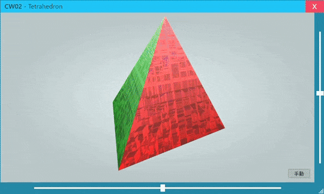

CodoZine 連載  
# [.NET Core 3で始めるWPFアプリ開発](https://codezine.jp/article/corner/805)

## 第2回: [**.NET Core 3で始めるWPFアプリ開発――Hello, WPF!**](https://codezine.jp/article/detail/11854) (2020/01/06)

- [Tetrahedron](./Tetrahedron/)  
今回の冒頭で紹介しているサンプルアプリ (上の画像)。 XAML だけで四面体を回転させています。
- [XamlAndCode](./XamlAndCode/)  
「XAMLの意義」(p.4) のサンプルコード
- [ImageButton](./ImageButton/)  
「コントロールのコンテンツで見た目を変える」(p.5) のサンプルコード  

